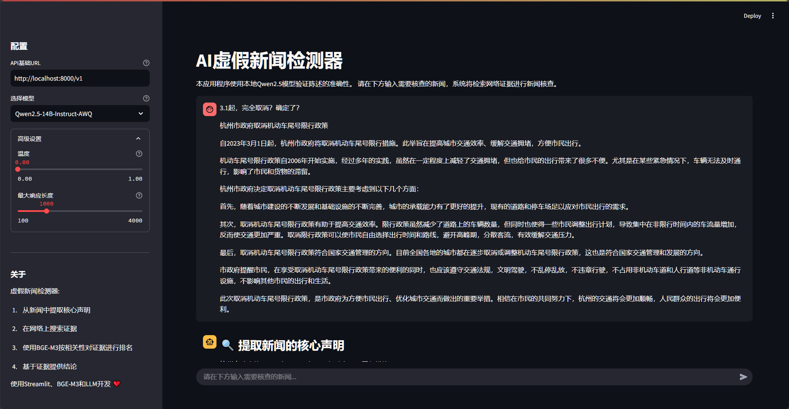

# 虚假新闻检测器 (Fake News Detector)

一个基于事实核查的虚假新闻自动检测系统，基于大型语言模型和BGE-M3-Embedding实现针对虚假新闻的事实核查，使用Streamlit构建Web界面。




## 项目结构
```
fake-news-detector/
│
├── app.py                  # 主应用程序入口
├── fact_checker.py         # 事实核查核心逻辑
├── auth.py                 # 用户认证系统
├── db_utils.py             # 数据库操作工具
├── pdf_export.py           # PDF报告生成
├── requirements.txt        # 项目依赖
├── factcheck.db           # SQLite数据库（自动创建）
├── .gitignore             # Git忽略文件
├── LICENSE                # 开源许可证
├── README.md              # 项目说明文档
│
└── docs/                  # 文档目录
    ├── images/            # 文档中使用的图片
    │   └── screenshot.png # 应用截图
    └── usage.md           # 详细使用说明
```
## 项目特点

- 🔍 **自动提取核心声明**：从新闻文本中提取可核查的核心声明
- 🌐 **实时网络搜索**：利用DuckDuckGo搜索引擎获取相关证据
- 🤖 **语义匹配**：使用BGE-M3大型嵌入模型计算声明与证据的相关性
- 📊 **分块证据处理**：自动将长文本分段并找出最相关的证据片段
- ✅ **可靠的事实核查**：基于证据给出正确、错误或部分正确的判断
- 🔄 **流式处理界面**：实时展示核查过程的每个步骤

## 快速开始

### 前提条件

- Python 3.12
- 本地部署的Qwen2.5模型或其他兼容OpenAI API的大语言模型
- BGE-M3嵌入模型（可选择本地部署或远程API）

### 安装

1. 克隆仓库
```bash
git clone https://github.com/yourusername/fake-news-detector.git
cd fake-news-detector
```

2. 安装依赖
```bash
pip install -r requirements.txt
```

3. 配置模型
在`fact_checker.py`中，根据需要修改BGE-M3模型路径：
```python
self.embedding_model = BGEM3FlagModel('/path/to/your/bge-m3/')
```

### 启动应用

```bash
streamlit run app.py
```

应用将在本地启动，通常为 http://localhost:8501

## 使用方法

1. 在应用界面中输入需要核查的新闻文本
2. 系统会自动：
   - 提取新闻的核心声明
   - 搜索相关证据
   - 分析证据相关性
   - 给出事实核查结论

## 系统架构

该应用采用了多步骤管道流程进行事实核查：

1. **提取阶段**：使用LLM从输入文本中提取可核查的声明
2. **搜索阶段**：通过搜索引擎API获取相关证据
3. **相关性排序**：使用BGE-M3嵌入模型计算证据与声明的语义相似度
4. **证据处理**：将长文本分块并找出最相关的证据片段
5. **判断阶段**：基于相关证据做出判断并给出推理过程

## 技术栈

- **前端界面**: Streamlit
- **语言模型**: Qwen2.5-14B
- **嵌入模型**: BGE-M3
- **搜索引擎**: DuckDuckGo
- **其他工具**: NumPy, OpenAI兼容API


## 贡献指南

欢迎贡献代码、提交问题或改进建议。请遵循以下步骤：

1. Fork该仓库
2. 创建功能分支 (`git checkout -b feature/xxx`)
3. 提交更改 (`git commit -m 'Add xxx feature'`)
4. 推送到分支 (`git push origin feature/xxx`)
5. 创建Pull Request

## 许可证

该项目采用MIT许可证 - 详情请参见 [LICENSE](LICENSE) 文件

## 联系方式

项目维护者: CaptainYifei - [@CaptainYifei](https://github.com/CaptainYifei)

项目链接: [https://github.com/CaptainYifei/fake-news-detector](https://github.com/CaptainYifei/fake-news-detector)